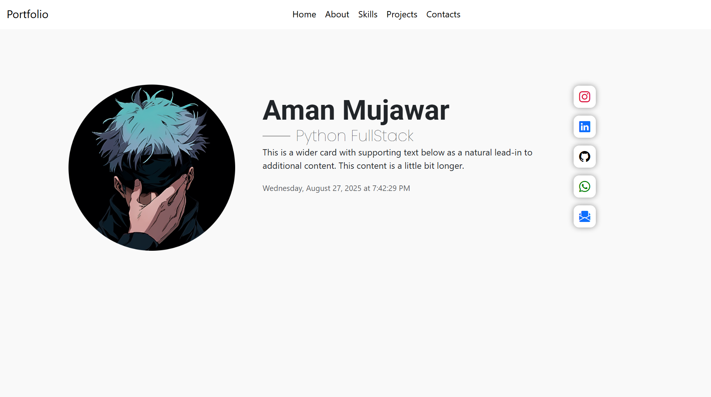

# Portfolio Website

A personal portfolio website built with **React.js** and **Bootstrap** to showcase my skills, projects, and contact information.  

---

## 🚀 Features
- Responsive design for all devices 📱💻
- Navigation menu (Home, About, Skills, Projects, Contacts)
- Profile section with avatar, bio, and skills
- Social media links (Instagram, LinkedIn, GitHub, WhatsApp, Gmail)
- Contact via WhatsApp or Email directly
- Clean and modern UI

---

## 🛠️ Tech Stack
- **React.js**
- **Bootstrap 5**
- **Bootstrap Icons**
- **JavaScript (ES6+)**
- **HTML5 & CSS3**

## 📂 Folder Structure
